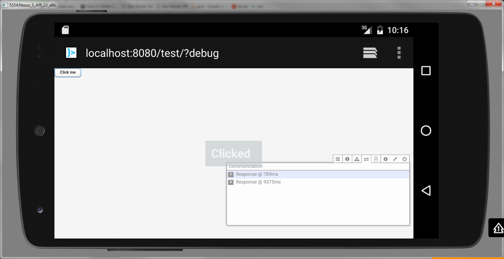

Vaadin on Dalvik demo application
========

This repository contains prototype web Vaadin application deployed to Android

How to run
----------
* Install out\vaadin-dalvik-demo.apk application to your Android device.
* Run the app
* Click "Open browser" button or visit http://localhost:8080/test?debug with your browser.

See also
----------

* [Vaadin experimental for Dalvik sources](https://dev.vaadin.com/review/gitweb?p=vaadin.git;a=tree;h=refs/heads/feature/dalvik;hb=refs/heads/feature/dalvik)
* Vaadin experimental for Dalvik binaries:
 * https://maven.vaadin.com/vaadin-prereleases/com/vaadin/vaadin-bom/7.7.0.dalvik1/
 * https://maven.vaadin.com/vaadin-prereleases/com/vaadin/vaadin-client/7.7.0.dalvik1/
 * https://maven.vaadin.com/vaadin-prereleases/com/vaadin/vaadin-client-compiled/7.7.0.dalvik1/
 * https://maven.vaadin.com/vaadin-prereleases/com/vaadin/vaadin-client-compiler/7.7.0.dalvik1/
 * https://maven.vaadin.com/vaadin-prereleases/com/vaadin/vaadin-push/7.7.0.dalvik1/
 * https://maven.vaadin.com/vaadin-prereleases/com/vaadin/vaadin-server/7.7.0.dalvik1/
 * https://maven.vaadin.com/vaadin-prereleases/com/vaadin/vaadin-shared/7.7.0.dalvik1/
 * https://maven.vaadin.com/vaadin-prereleases/com/vaadin/vaadin-spring/7.7.0.dalvik1/
 * https://maven.vaadin.com/vaadin-prereleases/com/vaadin/vaadin-spring-boot/7.7.0.dalvik1/
 * https://maven.vaadin.com/vaadin-prereleases/com/vaadin/vaadin-spring-boot-starter/7.7.0.dalvik1/
 * https://maven.vaadin.com/vaadin-prereleases/com/vaadin/vaadin-spring-parent/7.7.0.dalvik1/
 * https://maven.vaadin.com/vaadin-prereleases/com/vaadin/vaadin-themes/7.7.0.dalvik1/
 * https://maven.vaadin.com/vaadin-prereleases/com/vaadin/vaadin-widgets/7.7.0.dalvik1/

